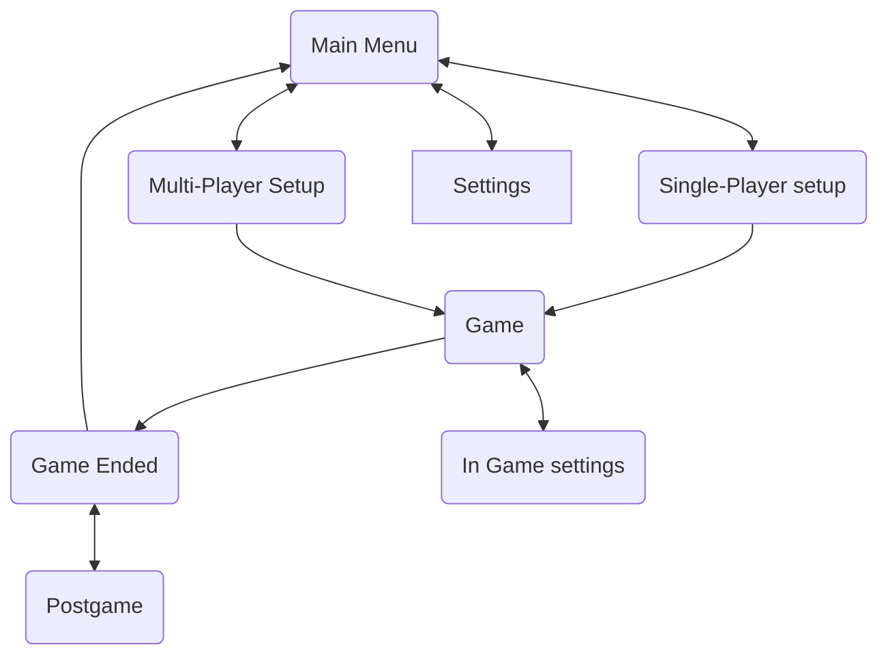

### Game Menu flow chart

## Single player vs Multi Player

The core decision comes down to whether single player should have one game loop or two. Multi player is forced to have two, from the player perspective.

1. The server's game loop (external)
2. The client's game loop (internal)

Single player can either just be multiplayer in disguise (two game loops), or actually single player where the AIs run on the same game loop as the player.

## Multi Player Options

- Auto placed game
	- A service picks who you play, maybe you have some input, like 1v1, 1v1v1, 2v2, etc
	- [ELO](https://en.wikipedia.org/wiki/Elo_rating_system) Placement
- Private game
	- You start a game, then you're given an identifier, you can give that to your friends, and they can join with that
- Self hosted game
	- People can start their own servers, and invite their friends to join their specific game.
	- This seems like the simplest way to start as an MVP
