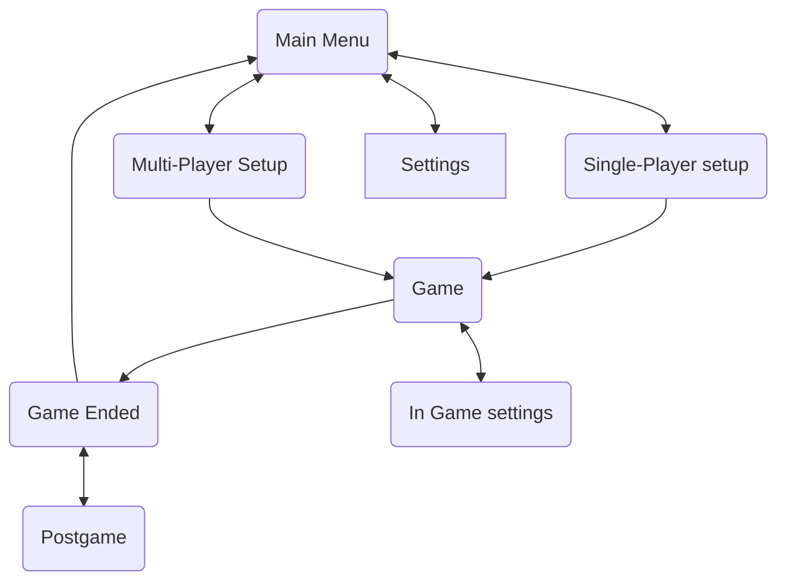

# Game Design Choices

## Game Menu flow chart



## Single player vs Multi Player

The core decision comes down to whether single player should have one game loop or two. Multi player is forced to have two, from the player perspective.

1. The server's game loop (external)
2. The client's game loop (internal)

Single player can either just be multiplayer in disguise (two game loops), or actually single player where the AIs run on the same game loop as the player.

## Multi Player Options

- Auto placed game
	- A service picks who you play, maybe you have some input, like 1v1, 1v1v1, 2v2, etc
	- [ELO](https://en.wikipedia.org/wiki/Elo_rating_system) Placement
- Private game
	- You start a game, then you're given an identifier, you can give that to your friends, and they can join with that
- Self hosted game
	- People can start their own servers, and invite their friends to join their specific game.
	- This seems like the simplest way to start as an MVP

## Multiplayer flow

Starting off, I see one spot to make a choice for game settings, like number of players or map

- First player to join
	- Whoever is the first to join a game would be the one who has special power to change settings
- Server sets options
	- This would require a headed UI, or passing in command line arguments
	- This seems like a worse option, as all players will need to set some game options anyways

### Choice

Does the server that manages players join the same one that runs the game, or does it send players to seperate server?

### Terms

Server
- The center of the game, what all the Clients connect to, runs AI
- The Server has 0 or 1 Hosts. Guests can only connect if a Host is connected

Client
- The program that connects to the Server

Player
- A human that is controlling a Client

Host
- The first Client that connects to the Server. This is only used for setting up the game, once a game is in progress, the distinction between Host and Guest is gone

Guest
- A player that can only change their own settings

### Flow

1. Server starts
2. Host joins
3. Host can mess with options
4. Any number of Guests join
5. The Host and Guests tell the Server when they have updated their options
6. Once the Host determines the game is ready to start, the ask the Server to start the game

### Requirements

- Given the server is running
- When Alice joins
- Then Alice is the Host
- And Alice is able to change the numbers of players to 3

---

- Given the server is running
- And Alice has connected
- When Bob joins
- Then Bob is a Guest
- And Bob is not be able to change the number  of players to 3

---

## Code Organization for multi/single player

I'd like to have different groups for the different game modes.
The logic for how to run a game should be independant of things like:

- how to render the game
- how to accept player input

This means that I'd need a couple of different components:

- Accept player input
- Render the game to a screen
- Run game logic
- Run the AI

I can see each of these as being a `Plugin` that could be added at build time.
For example, a normal single player game may need all of these.
But the multiplayer server might only need to run game logic and AI.

In order to connect all these components, something needs to act as glue.
In the multiplayer case, messages need to be sent over the network,
while in the single player case, we could use a different method of sending messages.

It makes sense to me to have another set of `Plugin`s that act as glue in different scenarios.
We might have one `Plugin` that takes events emitted by the game logic,
and sends those out over the network.
It would then have a similar `Plugin` that listens to the network, and emits game state changes.

That set of `Plugin`s would be able to connect a server to clients.
We could have a different `Plugin` that would skip the network.
It would take events emitted from the game logic, and perform game state changes.

### Initial design

After refactoring a `bevy_renet` example and some thought, I think I know how I want to set up these `Plugin`s. The main plugin will hold the game logic. This will take events/world queries as inputs, and change the state of the world. In the case of a single player game, nothing needs to be done to inform the player, since it will be in the same world, and the render will give all the information to the player. In the case of a multiplayer game, there will be a plugin that has queries, (mostly queries with a `Changed<_>` part). These changes can get sent over the network, and then replicated on the client side.

As far as getting user input to the game logic, we can have one player input component that converts keyboard/mouse events into game input events. We can then have to kinds of components that take game input events as input. One would convert those directly to world updates that the game logic would detect, and the other would be a pair of components to send and receive those events over the network in multiplayer scenario.

## Testing Considerations

Some ways I've thought of more effectively testing the code, depending on the situation.

### Unit Tests

Systems could be simple enough where the system basically calls a function in a loop, we could then unit test the inner function. Here's an example:

```rust
fn our_system(
    query_a: Query<&AComp>,
    query_b: Query<&BComp>,
    events: EventWriter<MyEvent>,
) {
	for a in query_a {
	    for b in query_b {
	        if let Some(event) = system_inner(a,b) {
	            events.send(event);
	        }
	    }
	}
}

fn system_inner(a: &AComp, b: &BComp) -> Option<MyEvent>{
    if ... {
        // do stuff
        Some(MyEvent::new(...))
    } else {
        None
    }
}

#[test]
fn test_our_system() {
    let a = AComp {...};
    let b = BComp {...};

    let actual = system_inner(&a, &b);

    assert_eq(actual, Some(MyEvent::new()));
}
```

I might have a few different kinds of tests like these, depending on the types, but I think the structure should be helpful.

No matter what, I would expect that bevy is not used in these tests. It might be quick enough if we include bevy, but there are a lot of extra dependencies that we'd need for each test.

### Integration Tests

I expect we will start to use bevy in these tests. My thought is that we only interact with the plugin that we add through events. We add any relevant  plugins and events, and send in events, and listen for the correct event coming out. I don't have as clear of an idea as to how this test will be specifically written though. Maybe something like this:

```rust
#[test]
fn sample_test() {
    // arrange
    let mut app = App::new()
        .add_plugins((BasePlugin, LogicPlugin));

    let mut create_units = app.get_resource::<Events<CreateUnits>>().unwrap();
    create_units.send(CreateUnit::villager(0, 0, 0));

    let mut create_units = app.get_resource::<Events<CreateUnits>>().unwrap();
    create_units.send(CreateUnit::GoldMine(1, 0, 1));

    // act
    let mut input_events = app.get_resource::<Events<InputEvent>>().unwrap();
    input_events.send(InputEvent::new());

    app.update(); // probably some kind of auto wait here
                  // maybe read events and update in a loop to finish as soon as possible?

    // assert
    let mut output_event = app.get_resource::<Events<OutPutEvent>>().unwrap();
    let actual = output_event.read();

    assert_aq(actual, OutputEvent::new());
}
```